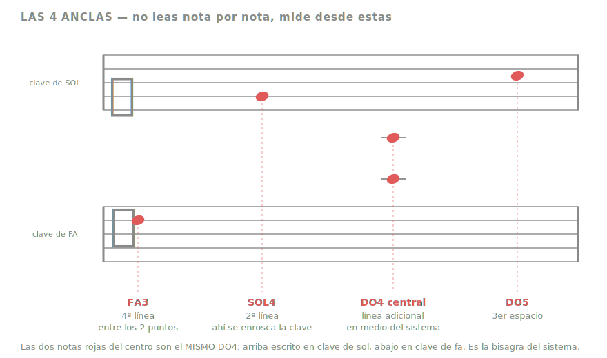
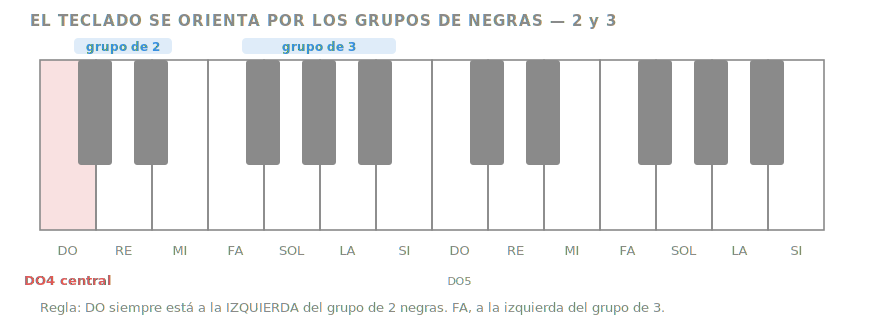
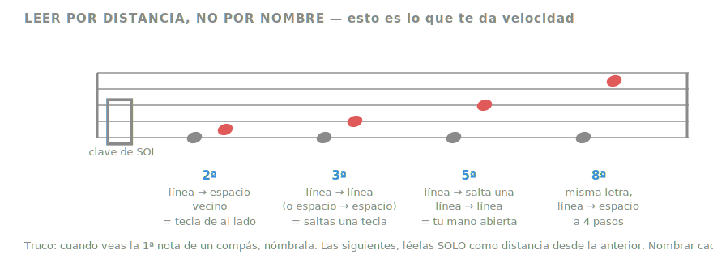
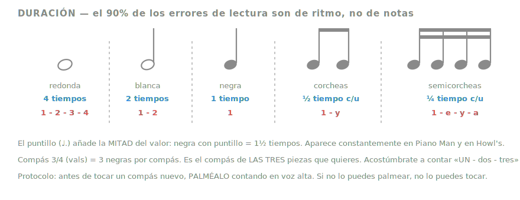

# Piano Speedrun — 19 jul → 29 nov 2026

**Punto de partida:** tocas *See You Again* (hasta el coro) y *Für Elise* (parcial) — pero de oído/tutorial, no leyendo.
**Meta:** leer partitura con fluidez + 2 piezas.
**Recursos:** piano acústico de media cola, 2+ h/día.
**Ventana real:** 16 semanas al piano (~190 h) — **del 8 al 30 de agosto estás en Alemania**, sin instrumento.

---

## 0. Diagnóstico honesto

Tus dedos van **adelantados** y tus ojos **atrás**. Eso es una buena posición de salida — ya tienes independencia de manos básica y sabes qué se siente tocar algo real — pero crea una trampa peligrosa:

> **Vas a sentir la tentación de aprender las 2 piezas por tutorial de YouTube y saltarte la lectura.**
> Si haces eso, en diciembre tendrás 2 piezas y cero habilidad. En 6 meses las habrás olvidado y estarás donde empezaste.

Todo este plan está diseñado para que las piezas se aprendan **leyendo**. Es más lento las primeras 4 semanas y mucho más rápido a partir de la semana 8.

**Regla de oro:** prohibido ver un tutorial de teclas cayendo (Synthesia) de las 2 piezas objetivo. Partitura o nada.

---

## 1. Qué es realista

| Pieza | Dificultad | Veredicto |
|---|---|---|
| **Merry-Go-Round of Life** — Howl's | Intermedio–avanzado | ✅ En arreglo intermedio. La versión original de Hisaishi (saltos de MI, textura densa) es para el año que viene. |
| **Epilogue** — La La Land | Avanzado (grado 8+) | ⚠️ **Recortada.** Meta real: ***Mia & Sebastian's Theme* completo**, que es la célula melódica de la que sale todo el Epilogue, + una sección lírica como objetivo ambicioso. El Epilogue íntegro es un medley de ~7 min de nivel concertista — no cabe en 16 semanas desde cero. |

Las dos están en **3/4** (vals). No es casualidad que te gusten — y te conviene: un solo compás que dominar a fondo.

> **Sobre quitar *Piano Man*:** hacía de andamio — enseñaba el patrón de vals en mano izquierda y la lectura de cifrados en una pieza fácil, *antes* de necesitarlos en Howl's. Al quitarla, esos mecanismos no desaparecen: se instalan en seco en el **puente técnico** (semanas 4–5), sin pieza de por medio. Es más árido, pero libera 4 semanas que van a Howl's (6 en vez de 5) y a La La Land (4 en vez de 3). Buen cambio, dado el viaje.

---

## 2. Lectura guiada — las 4 lecciones que importan

### Lección 1 — No leas nota por nota. Lee desde anclas.

Los principiantes recitan "mi-sol-si-re-fa" desde abajo cada vez. Eso tiene un techo de velocidad muy bajo. Los que leen rápido memorizan **4 notas ancla** y miden todo lo demás por distancia desde ellas.



Memoriza solo estas cuatro. Sin excepciones, sin recitar:

- **SOL4** — 2ª línea de la clave de sol (la clave se enrosca justo ahí; por eso se llama clave de *sol*)
- **DO4 central** — línea adicional entre los dos pentagramas. La bisagra del sistema entero.
- **FA3** — 4ª línea de la clave de fa (los dos puntos de la clave la abrazan; por eso, clave de *fa*)
- **DO5** — 3er espacio de la clave de sol

**Drill diario (5 min):** abre [Note Rush](https://noterushapp.com/) o [Tenuto](https://www.musictheory.net/products/tenuto). Modo notas sueltas, ambas claves. Objetivo: **60 notas correctas por minuto** al final de la semana 4.

---

### Lección 2 — Orientarte en el teclado por los grupos de negras



Nunca cuentes teclas desde el extremo. El patrón 2-negras / 3-negras es tu GPS:

- **DO** = tecla blanca inmediatamente a la izquierda del grupo de **2** negras
- **FA** = tecla blanca inmediatamente a la izquierda del grupo de **3** negras

**Drill diario (3 min):** con los **ojos cerrados**, toca todos los DO del piano de grave a agudo. Luego todos los FA. Luego todos los SOL. Esto construye el mapa táctil que te permitirá leer sin mirar las manos — que es el requisito real para leer a primera vista.

---

### Lección 3 — Leer por intervalo (aquí está la velocidad)



Esta es la lección que separa a quien lee de quien descifra. Nombra **solo la primera nota** de cada compás. Todo lo demás lo lees como movimiento:

- **línea → espacio vecino** = 2ª = tecla de al lado
- **línea → línea** (o espacio → espacio) = 3ª = saltas una tecla
- **línea → salta una línea → línea** = 5ª = la apertura natural de tu mano
- **misma letra, 4 pasos** = 8ª (octava)

Tu cerebro deja de traducir símbolo→nombre→tecla y pasa a leer **forma→movimiento**. Es la diferencia entre deletrear y leer.

---

### Lección 4 — Ritmo (donde ocurren el 90% de los fallos)



**Protocolo innegociable ante cualquier compás nuevo:**

1. **Palmea** el ritmo contando en voz alta — sin tocar el piano
2. Toca solo **mano izquierda**, contando en voz alta
3. Toca solo **mano derecha**, contando en voz alta
4. Manos juntas al **50% del tempo**
5. Sube de **5 en 5 bpm**. Si fallas, bajas 10 y repites 3 veces limpias

Si no puedes palmearlo, no puedes tocarlo. Saltarte el paso 1 es la causa número uno de estancarse.

---

## 3. La rutina diaria (2 h)

Nunca 2 h de lo mismo. El bloque partido rinde muchísimo más:

| Bloque | Tiempo | Qué |
|---|---|---|
| **Lectura a primera vista** | 25 min | Material **más fácil** de lo que sabes tocar. Nunca repitas un ejercicio: la lectura a primera vista se entrena con material *nuevo*. |
| **Técnica** | 20 min | Escalas + arpegios de las tonalidades de la fase actual. Czerny Op. 599. |
| **Repertorio** | 60 min | La pieza de la fase, en fragmentos, con metrónomo, siguiendo el protocolo de 5 pasos. |
| **Tocar por gusto** | 15 min | Lo que sea. *See You Again*, improvisar, lo que te dé la gana. |

**Si un día solo tienes 40 min:** lectura + repertorio. **Nunca saltes la lectura.** Es lo único acumulativo del plan.

**Un día libre a la semana.** El descanso consolida la memoria motora — no es opcional, es parte del entrenamiento.

---

## 4. Calendario — 16 semanas de piano

```
JUL 19 ─── AGO 7    Bloque A · alfabetización        3 sem
AGO 8  ─── AGO 30   ✈ ALEMANIA · solo lectura        (sin piano)
AGO 31 ─── SEP 13   Puente técnico                   2 sem
SEP 14 ─── OCT 25   Howl's                           6 sem
OCT 26 ─── NOV 22   La La Land                       4 sem
NOV 23 ─── NOV 29   Pulido                           1 sem
```

### Fase 1 · Semanas 1–3 (19 jul – 7 ago) — Alfabetización

Fase corta porque ya tienes dedos. Objetivo: pasar de "descifro" a "leo".

- [ ] Memorizar las 4 anclas (Lección 1)
- [ ] Note Rush a **60 notas/min**, ambas claves
- [ ] Drill de teclado a ojos cerrados: DO, FA, SOL
- [ ] *Improve Your Sight-Reading!* de Paul Harris — **Grade 1**, 2 ejercicios por día
- [ ] Escalas DO, SOL, FA — 2 octavas, manos separadas, 60 bpm
- [ ] **Recodificar Für Elise:** consigue la partitura ([IMSLP, dominio público](https://imslp.org/wiki/Bagatelle_in_A_minor,_WoO_59_(Beethoven,_Ludwig_van))) y toca leyendo la parte que ya sabes de oído. Es el mejor puente posible: los dedos ya la conocen, así que tu atención se va entera a los símbolos.

> **Puerta de salida:** identificas cualquier nota de ambas claves en **menos de 2 segundos** sin recitar.

---

### ✈ Alemania · 8 – 30 ago — Mantenimiento sin piano

No se pierde. **La lectura es la habilidad más perecedera del plan y la única que no necesita instrumento.** Con 15 min al día vuelves leyendo *mejor* que cuando te fuiste — y con los dedos apenas oxidados, cosa que se recupera en tres días.

- [ ] **10 min/día — reconocimiento de notas.** [Tenuto](https://www.musictheory.net/products/tenuto) o musictheory.net en el celular. Sin piano: solo identificar. *(Note Rush no sirve aquí, necesita micrófono y teclado real.)*
- [ ] **5 min/día — ritmo.** Palmea los ejercicios del libro de Harris contando en voz alta. En el tren, en el aeropuerto, donde sea.
- [ ] **Lleva el PDF del atril** en la tablet. Repasa las 4 anclas y los intervalos sin tocar nada.
- [ ] **Escucha las dos piezas objetivo** siguiendo la partitura con el dedo. Sin instrumento, entrenas el vínculo símbolo→sonido, que es exactamente lo que te falta.
- [ ] **Cero culpa por no tocar.** Estás de viaje. 15 min diarios es todo lo que pido.

> **Puerta de vuelta (31 ago):** mantienes las 60 notas/min del bloque A. Si bajaste, dedica 3 días a recuperarlo antes de seguir.

---

### Fase 2 · Semanas 4–5 (31 ago – 13 sep) — Puente técnico

Estas dos semanas hacen el trabajo que hacía *Piano Man*: instalar los mecanismos de Howl's **antes** de enfrentarte a la pieza. Sin repertorio de concierto, solo mecánica.

- [ ] **Patrón de vals en mano izquierda**: *bajo – acorde – acorde* en 3/4. Practícalo en DO, SOL, FA, RE m, LA m hasta que salga sin pensar. Es el motor rítmico de las dos piezas.
- [ ] **Cifrados americanos**: C, G, Am, F, Dm, E7. Te sirven para toda la música popular el resto de tu vida.
- [ ] **Pedal de resonancia** desde ya, 10 min/día: el pie sube *exactamente* cuando la mano baja en el cambio de armonía. Practícalo con acordes sueltos, sin pieza.
- [ ] **Arpegios** de tríada, manos separadas, 2 octavas
- [ ] Valses fáciles de lectura como material de paso — cualquiera de Grade 1–2. **No los memorices**, léelos y pásalos.
- [ ] Sight-reading: Harris **Grade 1 → 2**
- [ ] Técnica: escalas RE, LA · Czerny Op. 599 nº 1–15

> **Puerta:** patrón de vals + pedal limpio en 5 tonalidades, sin mirar las manos.

---

### Fase 3 · Semanas 6–11 (14 sep – 25 oct) — Merry-Go-Round of Life

Seis semanas: la fase más larga, y con razón. Es tu pieza más difícil.

- [ ] Conseguir un arreglo **intermedio** en [MuseScore](https://musescore.com/) — filtra por dificultad, **no agarres el primero que salga**. Busca uno de 3–4 páginas, no de 8.
- [ ] Arpegios de MI en 3/4 — el motor de la pieza (ya instalado en la Fase 2)
- [ ] Tonalidades con bemoles (Fa, Si♭)
- [ ] Ritmo: **8 compases nuevos por sesión**, máximo. Más es ilusión de avance.
- [ ] Semanas 6–8: sección A, manos separadas → juntas al 50%
- [ ] Semanas 9–10: sección B + enlaces
- [ ] Semana 11: pieza entera al 80% de tempo, con pedal
- [ ] Sight-reading: Harris **Grade 2**
- [ ] Técnica: escalas con bemoles · Czerny Op. 599 nº 16–30

> **Puerta:** pieza completa a tempo, con pedal limpio (sin "barro" armónico). Grábala en video.

---

### Fase 4 · Semanas 12–15 (26 oct – 22 nov) — La La Land

Cuatro semanas — con *Piano Man* fuera, el Epilogue vuelve a estar sobre la mesa como objetivo ambicioso.

- [ ] **Primero:** *Mia & Sebastian's Theme* completo. Es la célula melódica de la que sale todo el Epilogue — aprenderla primero hace que el Epilogue se lea casi solo.
- [ ] **Si va bien:** una de las secciones líricas del Epilogue (la reexposición del tema). **Objetivo ambicioso, no requisito** — si la semana 14 va justa, sáltalo sin remordimiento y pule el tema.
- [ ] Aquí cobras el interés de 15 semanas de lectura: vas a **leer** esta partitura, no memorizarla de oído. Nota la diferencia — es el momento en que el plan se paga solo.
- [ ] Sight-reading: Harris **Grade 2 → 3**

> **Puerta:** *Mia & Sebastian's Theme* completa y de memoria.

---

### Fase 5 · Semana 16 (23 – 29 nov) — Pulido

- [ ] **Cero material nuevo.** Solo consolidación.
- [ ] Las dos piezas a tempo, grabadas en video
- [ ] Trabajo de dinámica y expresión — *cómo* suenan, no solo qué notas
- [ ] **Toca para una persona real.** Cambia todo: descubres qué partes solo funcionan cuando estás relajado.
- [ ] Prueba final de lectura: agarra una partitura de Grade 1 que **nunca hayas visto** y tócala de corrido. Compárala con tu semana 1.

---

## 5. Materiales

**Lectura**
- *Improve Your Sight-Reading!* — Paul Harris (Grade 1 → 3). El estándar.
- [Sight Reading Factory](https://www.sightreadingfactory.com/) — genera ejercicios infinitos. El punto es que sea imposible memorizarlos.
- [Note Rush](https://noterushapp.com/) — te escucha por el micrófono, valida que tocaste la tecla correcta.

**Técnica**
- Czerny *Op. 599* desde el nº 1 — [gratis en IMSLP](https://imslp.org/wiki/Practical_Method_for_Beginners_on_the_Pianoforte,_Op.599_(Czerny,_Carl))
- Salta Hanon por ahora. Poco retorno para tu ventana de tiempo.

**Teoría (opcional, 10 min/día)**
- [musictheory.net](https://www.musictheory.net/lessons) — lecciones gratis, directas.

**Partituras**
- [IMSLP](https://imslp.org/) — dominio público (Beethoven, Czerny, Chopin)
- [MuseScore](https://musescore.com/) — arreglos de la comunidad para Howl's y La La Land
- [Musicnotes](https://www.musicnotes.com/) — ediciones oficiales de pago, si quieres una versión de referencia fiable

---

## 6. Dos cosas que no son negociables

### Afina el piano

Si tu media cola lleva más de un año sin afinar, estás entrenando el oído con información falsa y todo va a sonar desmotivante sin que sepas por qué. Es lo primero que haría, esta semana. En un instrumento de ese calibre, además, es mantenimiento básico.

### Profesor cada 2 semanas

~8 sesiones en total. **En un speedrun esto no es un lujo, es control de calidad.** Postura, digitación y tensión mal aprendidas en el mes 1 son invisibles para ti y te ponen un techo duro en el mes 4. Un profesor que te vea 30 min cada dos semanas es la diferencia entre llegar a Howl's y estancarte en la semana 10 sin entender por qué.

**Ahora importa más que antes:** sin *Piano Man* de por medio, saltas de la alfabetización a una pieza intermedia-avanzada con solo dos semanas de puente. Ese salto es exactamente donde un ojo externo evita que instales malos hábitos.

Dile exactamente esto: *"toco algo de oído, quiero aprender a leer, tengo estas 2 piezas objetivo y fecha tope el 29 de noviembre — y estaré 3 semanas fuera en agosto."* Un buen profesor reorganiza el plan alrededor de eso.

---

## 7. Señales de alarma

| Señal | Qué significa | Qué hacer |
|---|---|---|
| Memorizas la pieza pero no puedes leerla | Estás volviendo al oído | Tapa el teclado con una toalla y lee en voz alta las notas sin tocar |
| Dolor en muñecas o antebrazos | Tensión — riesgo de lesión real | **Para.** Revisa postura con el profesor antes de seguir |
| No avanzas hace 5 días | Fragmento demasiado grande | Redúcelo a 2 compases y baja el tempo un 30% |
| Aburrimiento en la semana 7 | Normal y esperado | Sube los 15 min de "tocar por gusto" a 30 esa semana |

---

## 8. Registro

| Semana | Fechas | Fase | Horas | Puerta superada |
|---|---|---|---|---|
| 1 | 19–25 jul | Alfabetización | | |
| 2 | 26 jul–1 ago | Alfabetización | | |
| 3 | 2–7 ago | Alfabetización | | ☐ notas <2 s |
| — | **8–30 ago** | **✈ Alemania — solo lectura, 15 min/día** | | ☐ mantuve 60 notas/min |
| 4 | 31 ago–6 sep | Puente técnico | | |
| 5 | 7–13 sep | Puente técnico | | ☐ vals + pedal en 5 tonalidades |
| 6 | 14–20 sep | Howl's · sección A | | |
| 7 | 21–27 sep | Howl's · sección A | | |
| 8 | 28 sep–4 oct | Howl's · sección A | | |
| 9 | 5–11 oct | Howl's · sección B | | |
| 10 | 12–18 oct | Howl's · sección B | | |
| 11 | 19–25 oct | Howl's · entera | | ☐ Howl's completa con pedal |
| 12 | 26 oct–1 nov | La La Land · tema | | |
| 13 | 2–8 nov | La La Land · tema | | |
| 14 | 9–15 nov | La La Land · tema | | |
| 15 | 16–22 nov | La La Land · (+Epilogue) | | ☐ Mia & Sebastian's |
| 16 | 23–29 nov | Pulido | | ☐ Las 2 grabadas |
